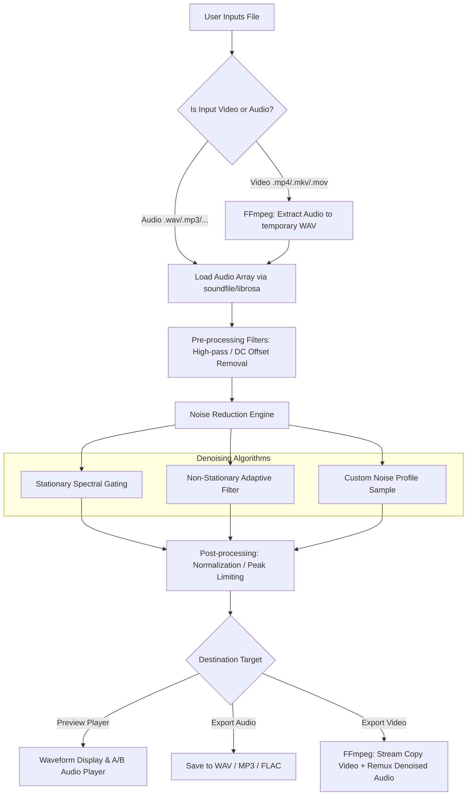

# Audio & Video Noise Reduction GUI Software
## Technical Architecture & Agent Specification Document

---

## 1. Project Overview & Objectives

This project aims to build a modern, robust, cross-platform **Desktop GUI Application in Python** designed to eliminate background noise from both **audio** and **video** files.

### Key Capabilities:
- **Audio Processing**: Support common formats (`.wav`, `.mp3`, `.flac`, `.aac`, `.m4a`, `.ogg`). Apply advanced DSP / AI noise reduction with customizable parameters.
- **Video Processing**: Support common video containers (`.mp4`, `.mkv`, `.mov`, `.avi`). Extract audio in high-fidelity, apply noise reduction, and remux cleaned audio with original video without re-encoding video streams (fast & preserving 100% video quality).
- **Interactive Audio Preview**: Side-by-side comparison ("Original" vs "Denoised") with interactive waveform visualization and audio playback.
- **Batch Processing**: Queue multiple files with progress tracking.
- **Modern GUI**: Polished, responsive dark-mode UI built with **CustomTkinter** or **PyQt6**.

---

## 2. Directory Structure

To maintain clean separation of concerns and uniformity across future agent contributions, the project follows this exact modular layout:

```text
python-audio-noise-reduction/
│
├── PROJECT_SPEC.md              # Project architectural blueprint & guidelines (this document)
├── README.md                    # User setup, installation, and quickstart guide
├── requirements.txt             # Python dependencies
├── main.py                      # Application entry point
│
├── core/                        # Core audio & video processing engines (headless / decoupled from GUI)
│   ├── __init__.py
│   ├── audio_engine.py          # DSP / Spectral gating / AI noise reduction algorithms
│   ├── video_engine.py          # FFmpeg demuxing, audio extraction, and remuxing
│   └── filter_pipeline.py       # Audio filters (High-pass, Low-pass, Normalization, Noise Gate)
│
├── gui/                         # GUI layer (View & Controller logic)
│   ├── __init__.py
│   ├── app.py                   # Main GUI Window & Navigation
│   ├── theme.py                 # Color schemes, typography, and styling constants
│   ├── components/              # Modular UI widgets
│   │   ├── __init__.py
│   │   ├── drop_zone.py         # Drag-and-drop file import area
│   │   ├── waveform_view.py     # Interactive Matplotlib / Canvas audio waveform visualizer
│   │   ├── player_controls.py   # Audio play/pause, seek, volume, A/B toggle
│   │   ├── settings_panel.py    # Denoising algorithm sliders (strength, stationary vs non-stationary)
│   │   └── progress_modal.py    # Multi-file batch progress bar and status log
│
├── utils/                       # Shared utility functions
│   ├── __init__.py
│   ├── ffmpeg_helper.py         # FFmpeg binary discovery, validation, and execution
│   ├── audio_io.py              # Soundfile / librosa / pydub audio loading and saving helpers
│   └── logger.py                # Standardized logging and error tracking
│
└── tests/                       # Unit & integration test suite
    ├── __init__.py
    ├── test_audio_engine.py
    ├── test_video_engine.py
    └── test_ffmpeg.py
```

---

## 3. Technology Stack & Dependencies

| Component | Library / Tool | Rationale |
| :--- | :--- | :--- |
| **GUI Framework** | `customtkinter` (or `PyQt6`) | Modern Dark/Light theme, native feel, lightweight, easy packaging |
| **Audio I/O & DSP** | `soundfile`, `librosa`, `numpy`, `scipy` | Fast array-based audio processing, resampling, and waveform analysis |
| **Noise Reduction** | `noisereduce` (Spectral Gating) + Optional `torch` (AI models: DeepFilterNet) | Stationary and non-stationary adaptive noise suppression |
| **Video & Media Muxing** | `ffmpeg` (via direct subprocess with bundled/system fallback) | Stream-copy video remuxing, wide codec support, lightning-fast |
| **Waveform Visualization** | `matplotlib` / Canvas visualizer | Waveform rendering before and after denoising |
| **Audio Playback** | `pygame` or `sounddevice` | Cross-platform real-time audio playback for previews |

---

## 4. Processing Pipeline Specification



### Video Stream-Copy Rule:
When re-exporting video files:
`ffmpeg -i original_video.mp4 -i cleaned_audio.wav -c:v copy -c:a aac -b:a 320k -map 0:v:0 -map 1:a:0 output_cleaned.mp4`
This guarantees **zero loss** in video quality and completes in seconds regardless of video resolution (4K/1080p).

---

## 5. Standard Coding Conventions for Agents

1. **Decoupled Architecture**: 
   - No business logic inside GUI callbacks.
   - All audio/video operations must run inside worker threads or background tasks (`threading.Thread` or `concurrent.futures`) so the GUI never freezes.
2. **Type Annotations**:
   - Use Python 3.10+ type hints for all function signatures (`path: Path | str`, `sr: int`, `data: np.ndarray`).
3. **Comprehensive Error Handling**:
   - Gracefully handle missing codecs, corrupted files, missing FFmpeg binaries, and out-of-memory audio clips.
4. **Temporary File Cleanliness**:
   - All temporary audio extractions must use `tempfile.TemporaryDirectory()` and clean up automatically upon export or app exit.

---

## 6. Implementation Roadmap

- [ ] **Phase 1**: Setup project structure, `requirements.txt`, logger, and FFmpeg detection helper.
- [ ] **Phase 2**: Implement core Audio Engine (`audio_engine.py`, `filter_pipeline.py`) with spectral gating and adjustable reduction strength.
- [ ] **Phase 3**: Implement core Video Engine (`video_engine.py`) for lossless audio extraction and muxing.
- [ ] **Phase 4**: Build the GUI layout with CustomTkinter (File selector, drag-and-drop, sliders for reduction strength, frequency roll-off).
- [ ] **Phase 5**: Add interactive Waveform visualization and real-time audio playback preview (A/B testing).
- [ ] **Phase 6**: Integrate multi-threading, batch processing, and export options.
