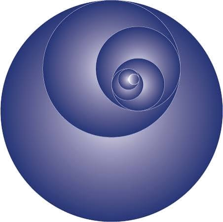
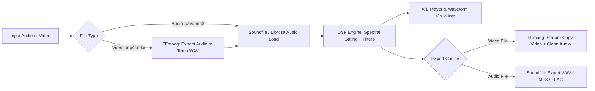

<div align="center">



# CNAT NOISERELIEF
### Audio & Video Background Noise Reduction GUI

[](https://www.python.org/)
[](https://www.codernaccotax.co.in)
[](tel:7003756860)
[](LICENSE)

**Professional-grade, instantaneous background noise reduction for audio tracks and video files with zero video quality loss.**

🏢 **Created by [Coder & AccoTax](https://www.codernaccotax.co.in)** | 🌐 **[www.codernaccotax.co.in](https://www.codernaccotax.co.in)** | 📞 **Ph: 7003756860**

[Key Features](#-key-features) •
[Documentation](#-documentation-index) •
[Installation](#-installation--quickstart) •
[Architecture](#-system-architecture) •
[Creator Details](#-about-the-creator)

</div>

---

## 🌟 Key Features

- 🎧 **Audio Noise Reduction**: Spectral gating & adaptive filtering for `.wav`, `.mp3`, `.flac`, `.aac`, `.m4a`, `.ogg`. Eliminates background hum, AC/fan noise, hiss, and ambient rumble.
- 🎬 **Video Track Processing**: Drop any `.mp4`, `.mkv`, `.mov`, or `.avi` video. Automatically extracts audio, reduces noise, and remuxes cleaned audio back into the video in seconds using **FFmpeg Lossless Stream-Copy (`-c:v copy`)** — zero re-encoding and 100% video clarity preserved.
- ✂️ **Lossless Video Splitter & Trimmer**: Split videos into equal clips (15s, 30s for WhatsApp/Reels/Stories, 60s for Shorts, or custom parts) or custom `[Start - End]` time cuts with lossless stream-copy or simultaneous background audio denoising.
- ✂️ **Audio Track Splitter & Silence Cutter**: Split audio files by fixed duration, into N equal parts, custom timestamp range cuts, or **automatic silence detection** (identifies pause intervals to separate voice takes/chapters) with optional instant AI denoising.
- 🎵 **Direct Video Sound Extraction**: Dedicated tool & export modes to extract audio tracks from any video container into MP3 (320k), WAV (Lossless PCM), FLAC, AAC, or OGG — with options for raw untouched extraction or AI-denoised sound.
- 📊 **Interactive Dual Waveform View**: Real-time side-by-side visual comparison of the original noisy signal vs. denoised output with live SNR gain and noise attenuation metrics.
- 🔁 **Instant 3-Way A/B/Δ Audio Preview**: Gapless live switching between Clean (B), Noise Only (Δ), and Original (A) during playback to audit sound quality before exporting.
- ⚡ **Non-Blocking Multithreaded GUI**: Modern Studio Dark-Themed GUI (CustomTkinter) with smooth 60 FPS responsiveness.
- 📦 **Batch Processing Queue**: Queue multiple files with real-time progress indicators.

---

## 📚 Documentation Index (`doc/`)

This project follows an authoritative documentation structure. For technical details, please refer to:

| Document | Description |
| :--- | :--- |
| 🤖 [**`AGENTS.md`**](file:///e:/python%20audio%20noise%20reduction/AGENTS.md) | AI Agent operating rules, directory layout, coding conventions & standards |
| 🏗️ [**`doc/system_architecture.md`**](file:///e:/python%20audio%20noise%20reduction/doc/system_architecture.md) | High-level system architecture, DSP pipelines, FFmpeg remuxing, Mermaid diagrams |
| 📋 [**`doc/feature_specifications.md`**](file:///e:/python%20audio%20noise%20reduction/doc/feature_specifications.md) | Feature Epics, DSP parameter definitions, audio/video matrix, acceptance criteria |
| ⚙️ [**`doc/tech_stack_and_engine.md`**](file:///e:/python%20audio%20noise%20reduction/doc/tech_stack_and_engine.md) | Technical stack justification, DSP mathematics, FFmpeg performance benchmarks |
| 🎨 [**`doc/ui_ux_design.md`**](file:///e:/python%20audio%20noise%20reduction/doc/ui_ux_design.md) | UI wireframes, Cyber-Acoustic color palette, interactive component specs |
| 🧪 [**`doc/testing_and_verification.md`**](file:///e:/python%20audio%20noise%20reduction/doc/testing_and_verification.md) | Synthetic test generators, SNR verification suites, Pytest configuration |
| 📖 [**`doc/user_manual.md`**](file:///e:/python%20audio%20noise%20reduction/doc/user_manual.md) | Step-by-step user guide, parameter tuning handbook, keyboard shortcuts, FAQ |
| 📑 [**`doc/project_documentation.md`**](file:///e:/python%20audio%20noise%20reduction/doc/project_documentation.md) | Module ownership breakdown, contribution guidelines, release roadmap |

---

## 🚀 Installation & Quickstart

### 1. Prerequisites
- Python 3.10+ installed
- FFmpeg installed and added to `PATH` (or bundled automatically via `imageio-ffmpeg`)

### 2. Automatic 1-Click Setup (Windows)
After cloning or doing a `git pull`, simply run:
```cmd
setup.bat
```
This automatically configures the `.venv` virtual environment, installs/upgrades all dependencies from `requirements.txt`, verifies FFmpeg, and prepares sample files.

To launch the app at any time:
```cmd
run.bat
```

### 3. Manual Setup (Cross-Platform)
```bash
# Clone the repository
git clone https://github.com/sukantahui/python-audio-noise-reduction.git
cd python-audio-noise-reduction

# Create virtual environment
python -m venv .venv

# Activate virtual environment
# Windows:
.\.venv\Scripts\activate
# macOS/Linux:
source .venv/bin/activate

# Install dependencies
pip install -r requirements.txt

# Launch application
python src/main.py
```

---

## 🏛️ System Architecture



---

## 🗺️ Implementation Roadmap

- [x] **Documentation & System Architecture** (`AGENTS.md`, `doc/*`)
- [ ] **Core Audio DSP Engine & Filter Pipeline** (`src/core/audio_engine.py`)
- [ ] **Core Video Demux & Remux Engine** (`src/core/video_engine.py`)
- [ ] **CustomTkinter GUI & Waveform Visualizer** (`src/gui/*`)
- [ ] **Real-time A/B Audio Player & Scrubber** (`src/gui/components/*`)
- [ ] **Batch Processing & Test Verification Suite** (`tests/*`)

---

## 🏢 About the Creator

This project is created and maintained by **Coder & AccoTax**.

- 🌐 **Website**: [www.codernaccotax.co.in](https://www.codernaccotax.co.in)
- 📞 **Phone / Contact**: `7003756860`
- 💼 **Services**: Custom Software Development, AI Solutions, Web & Mobile Applications, Accounting & Tax Solutions.

---

## 📄 License
This project is licensed under the MIT License.
