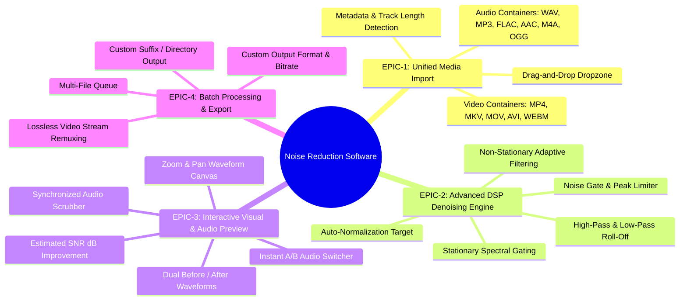
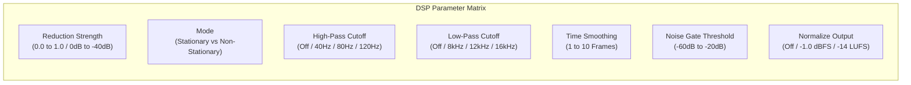
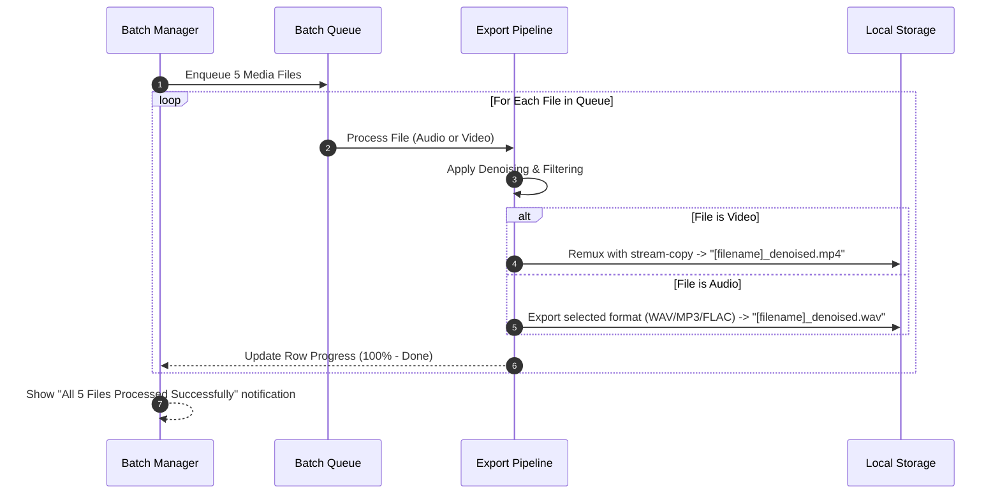

# Feature Specifications — Audio & Video Noise Reduction Software

> **Status**: Approved Specifications  
> **Document Version**: 1.0.0  
> **Target Audience**: Developers, AI Agents, Quality Assurance

---

## 1. Feature Epics Overview

The software delivers four core functional Epics:

---

## 2. Detailed Epic & Feature Specifications

### EPIC-1: Unified Media Import & Analysis

| Feature ID | Feature Name | Description | Acceptance Criteria |
| :--- | :--- | :--- | :--- |
| **FEAT-101** | Drag-and-Drop Import | User drops single or multiple files onto the UI dropzone. | - Accepts valid extensions (`.wav`, `.mp3`, `.flac`, `.aac`, `.m4a`, `.ogg`, `.mp4`, `.mkv`, `.mov`, `.avi`, `.webm`). - Highlights drop zone on hover. - Rejects unsupported formats with friendly modal error. |
| **FEAT-102** | Video Audio Extraction | If a video file is detected, automatically extract audio stream to high-fidelity temporary WAV. | - Extracts full uncompressed 16-bit / 24-bit PCM at original sample rate. - Extracts in under 2 seconds for a 1-hour video. - Preserves multi-channel (Stereo/5.1) layout. |
| **FEAT-103** | Audio Metadata Parsing | Inspect file duration, sample rate, channels, codec, bit depth, and file size. | - Displays metadata badge in the UI (e.g., `48.0 kHz | Stereo | 03:42 | MP4`). |

---

### EPIC-2: DSP Noise Reduction Controls & Parameters

The user can customize the noise reduction pipeline using intuitive presets ("Mild Hiss", "Aggressive Fan/AC", "Outdoor Wind/Urban", "Voice Podcast Clear") or fine-tune individual DSP sliders:

#### Parameter Reference Table:

| Parameter Name | Data Type | Default Value | Valid Range | Function & DSP Impact |
| :--- | :--- | :--- | :--- | :--- |
| `reduction_strength` | `float` | `0.80` (80%) | `0.10` – `1.00` | Controls the gain multiplier applied to frequency bins identified as noise. Higher values remove more noise but may introduce slight phase artifacts. |
| `stationary_mode` | `bool` | `True` | `True` / `False` | `True`: Assumes consistent background noise (fans, hums). Fast and clean. `False`: Continuously tracks changing noise floors (wind, city streets). |
| `high_pass_hz` | `int` | `80` Hz | `0` – `300` Hz | Butterworth high-pass filter to eliminate sub-bass rumble, microphone handling thumps, and electrical AC hum (50Hz/60Hz). `0` disables filter. |
| `low_pass_hz` | `int` | `0` (Off) | `0` – `20000` Hz | Filters out ultra-high frequency hiss above vocal range. |
| `time_smoothing` | `int` | `3` | `1` – `10` | Temporal smoothing across STFT time frames. Eliminates "musical chirping" artifacts. |
| `noise_gate_db` | `float` | `0.0` (Off) | `-70.0` – `-10.0` dB | Hard/Soft gate to silence residual noise during pauses between speech. |
| `normalize` | `bool` | `True` | `True` / `False` | Peak normalizes denoised audio to `-1.0 dBFS` to restore optimal listening volume. |

---

### EPIC-3: Interactive Visual & Audio Preview

| Feature ID | Feature Name | Description | Acceptance Criteria |
| :--- | :--- | :--- | :--- |
| **FEAT-301** | Dual Waveform Display | Shows top waveform (Original Dirty Signal in Red/Amber) and bottom waveform (Denoised Signal in Emerald/Cyan). | - Downsampled 60 FPS responsive render. - Shows amplitude envelope clearly. - Visual playhead bar moves synchronously with audio. |
| **FEAT-302** | Instant A/B Toggle | User can switch between Original and Clean audio seamlessly while playback is active. | - Gapless audio switching (< 5ms switch latency). - Visual indicator switches between `[A: Original]` and `[B: Clean]`. |
| **FEAT-303** | SNR Metric Display | Displays estimated Signal-to-Noise Ratio before and after processing. | - Displays badge (e.g., `Original: 12.4 dB SNR → Clean: 28.1 dB SNR (+15.7 dB)`). |

---

### EPIC-4: Batch Processing & Export Engine

#### Output Naming & Directory Options:
- **Default Output Mode**: Save in the same directory with customizable suffix (e.g., `interview_cleaned.mp4`).
- **Custom Directory Mode**: Save all outputs to a specified folder (e.g., `D:\Cleaned_Media\`).
- **Export Formats (for Audio)**:
  - `WAV` (16-bit, 24-bit, 32-bit float PCM)
  - `MP3` (128 kbps, 192 kbps, 256 kbps, 320 kbps VBR/CBR)
  - `FLAC` (Lossless 24-bit)
- **Export Formats (for Video)**:
  - Original Container (`.mp4`, `.mkv`, `.mov`) with video stream-copy (`-c:v copy`) and AAC / FLAC audio track.
