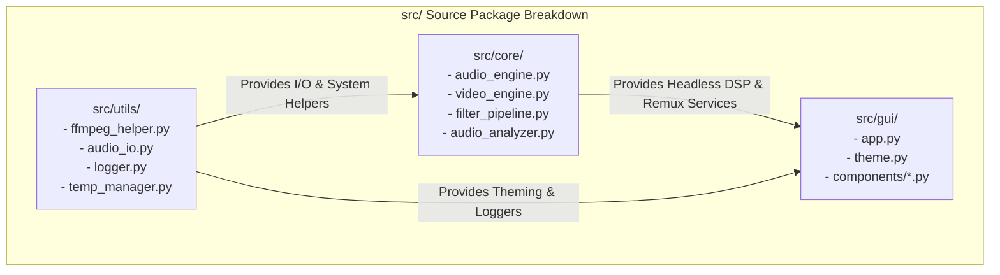
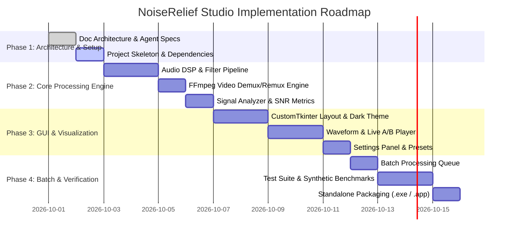

# Project Documentation & Contribution Blueprint

> **Project Name**: NoiseRelief Studio — Audio & Video Noise Reduction Software  
> **Created By**: Coder & AccoTax ([www.codernaccotax.co.in](https://www.codernaccotax.co.in) | Ph: 7003756860)  
> **Repository**: `sukantahui/python-audio-noise-reduction`  
> **Current Version**: `1.0.0`

---

## 1. Executive Summary

NoiseRelief Studio is an open-source, high-performance desktop application engineered in Python to make professional-grade audio and video noise reduction accessible, instantaneous, and visually intuitive. 

By combining **vectorized Spectral Gating DSP algorithms** with **FFmpeg lossless video stream muxing**, the software allows podcasters, content creators, educators, and engineers to clean noisy audio tracks from audio and video recordings without requiring complex DAWs or slow video re-rendering pipelines.

---

## 2. Module Responsibilities & Ownership Matrix

| Module Path | Primary Responsibility | Key Interfaces & Classes |
| :--- | :--- | :--- |
| `src/core/audio_engine.py` | Noise reduction algorithms, STFT computation, spectral gating masks | `NoiseReductionEngine`, `reduce_noise()` |
| `src/core/video_engine.py` | FFmpeg audio demuxing and lossless video remuxing | `VideoEngine`, `extract_audio()`, `remux_video()` |
| `src/core/filter_pipeline.py` | High-pass, low-pass, notch, noise gate, and normalizers | `FilterPipeline`, `apply_highpass()`, `apply_gate()` |
| `src/core/audio_analyzer.py` | Waveform min-max downsampling and SNR computation | `AudioAnalyzer`, `compute_waveform_envelope()`, `estimate_snr()` |
| `src/gui/app.py` | Main CustomTkinter application window and thread dispatcher | `NoiseReductionApp` |
| `src/gui/components/` | Modular UI widgets (DropZone, Waveform, Controls, Settings) | `DropZone`, `WaveformWidget`, `PlayerControls`, `SettingsPanel` |
| `src/utils/ffmpeg_helper.py` | FFmpeg detection, path resolution, and command execution | `FFmpegHelper`, `get_ffmpeg_path()`, `run_ffmpeg()` |
| `src/utils/audio_io.py` | Soundfile / Librosa audio reading and multi-format saving | `AudioIO`, `load_audio()`, `save_audio()` |

---

## 3. Development & Release Roadmap

---

## 4. Coding & Contribution Guidelines

1. **Format & Linting**: Use `black` (line length 100) and `ruff` / `flake8`.
2. **Type Safety**: All PRs must pass `mypy` static type analysis without errors.
3. **Unit Tests**: Every new DSP filter or video function must include corresponding unit tests in `tests/`.
4. **Git Commit Conventions**: Use Conventional Commits format (`feat: ...`, `fix: ...`, `docs: ...`, `refactor: ...`, `test: ...`).
