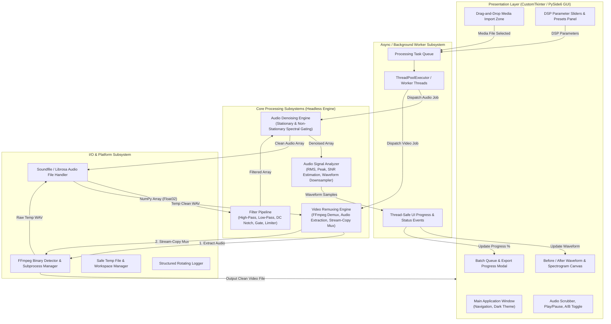
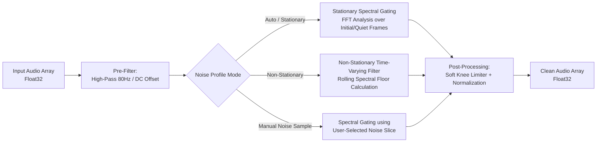
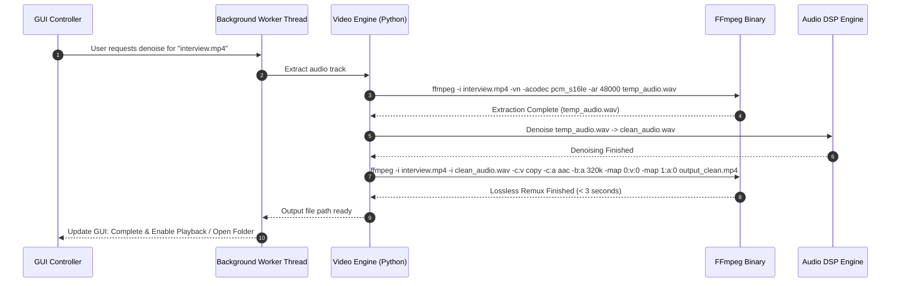

# System Architecture — Audio & Video Noise Reduction Software

> **Status**: Approved Architectural Blueprint  
> **Software Category**: Cross-Platform Desktop Audio & Video Denoising GUI  
> **Target Python Version**: Python 3.10+

---

## 1. High-Level System Architecture

The application is architected around a strict **Three-Tier Modular Design** separating the Presentation Layer (GUI), the Core Signal & Video Processing Engines (Headless DSP), and the I/O / Platform Utilities.

---

## 2. Subsystem Breakdown & Component Architecture

### 2.1. Audio Denoising Subsystem (`src/core/audio_engine.py`)
The Audio Engine operates directly on floating-point multi-channel or mono NumPy arrays (`np.ndarray` of dtype `np.float32`, shape `(channels, samples)`):

#### Key Algorithms & Math:
- **Spectral Gating**: Converts audio to Short-Time Fourier Transform (STFT). For each frequency bin $f$ and time frame $t$, the magnitude $|X(t,f)|$ is compared against a noise threshold $\Theta(f)$.
- **Masking Gain**: Multiplies spectral magnitude by gain mask $G(t, f) = \max\left(1 - \frac{\alpha \cdot \Theta(f)}{|X(t,f)|}, 1 - \text{reduction\_strength}\right)$.
- **Time Smoothing**: Consecutive masks are smoothed across time windows to eliminate "musical noise" (random isolated spectral peaks).

---

### 2.2. Video Processing & Stream-Copy Engine (`src/core/video_engine.py`)

When a user supplies a video file, the software never performs expensive video transcoding. Instead, it extracts the audio track, applies DSP noise suppression, and remuxes the audio into the original container using FFmpeg stream copy.

#### FFmpeg Command Rules:
1. **Extraction**: `ffmpeg -y -i "{input_video}" -vn -acodec pcm_s16le -ar {sample_rate} "{temp_wav}"`
2. **Remuxing (MP4/MKV/MOV)**: `ffmpeg -y -i "{input_video}" -i "{clean_wav}" -c:v copy -c:a aac -b:a 320k -map 0:v:0 -map 1:a:0 -shortest "{output_video}"`
3. **Lossless Remuxing (FLAC/PCM in MKV)**: `ffmpeg -y -i "{input_video}" -i "{clean_wav}" -c:v copy -c:a flac -map 0:v:0 -map 1:a:0 "{output_video}"`

---

### 2.3. Threading & Concurrency Model

To maintain 60 FPS UI responsiveness on Windows/macOS/Linux, all computationally intensive tasks are strictly offloaded from the Tkinter/Qt main event loop:

- **GUI Main Thread**: Handles user clicks, slider drags, UI redraws, waveform canvas animations.
- **Worker Thread Pool (`ThreadPoolExecutor(max_workers=N)`)**:
  - Worker 1: Audio loading and FFT decomposition.
  - Worker 2: Spectral gating and inverse STFT synthesis.
  - Worker 3: FFmpeg extraction and remuxing child processes.
- **Inter-Thread Communication**: Thread-safe queues (`queue.Queue`) and custom events dispatch progress callbacks (`update_progress(percent: float, message: str)`) to the GUI thread via thread-safe UI scheduling.

---

### 2.4. Audio Signal Analyzer & Waveform Rendering (`src/core/audio_analyzer.py`)

Waveforms with millions of audio samples cannot be rendered in real-time on UI canvases without optimization.
- **Peak Min-Max Downsampling**: Downsamples a 10,000,000-sample audio array to exact canvas pixel width (e.g., 800 to 1200 points) by computing $(\min, \max)$ envelopes for each pixel bucket.
- **SNR Estimation**: Computes estimated Signal-to-Noise Ratio (in dB) using root-mean-square energy difference between speech activity frames and background silence frames:
  $$\text{SNR}_{\text{dB}} = 10 \cdot \log_{10}\left(\frac{P_{\text{signal}}}{P_{\text{noise}}}\right)$$
- **Spectrogram Generation**: Optional 2D Mel-Spectrogram matrix computation for visual inspection of frequency energy before and after filtering.
