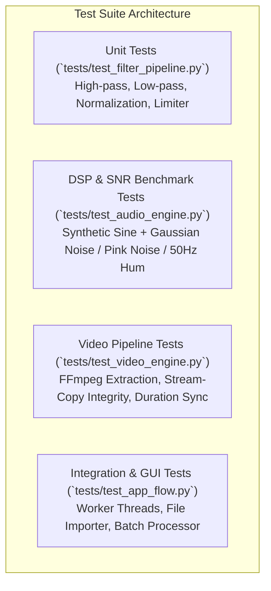

# Testing & Verification Guide

> **Test Framework**: `pytest`  
> **Target Test Coverage**: $> 85\%$ across core DSP, video engine, and utilities

---

## 1. Testing Strategy Overview

The testing pipeline ensures mathematical correctness of the DSP algorithms, lossless video remuxing, and robust error handling across edge cases.



---

## 2. Synthetic Audio Fixtures & Generators (`tests/conftest.py`)

To eliminate dependency on large proprietary media files in version control, tests use programmatic synthetic audio generators:

1. **Clean Speech / Melody Simulation**:
   - Multi-harmonic sinusoidal sweep: $s(t) = \sin(2\pi 440 t) + 0.5 \sin(2\pi 880 t) + 0.25 \sin(2\pi 1320 t)$.
2. **Synthetic Noise Profiles**:
   - **Gaussian White Noise**: $n_{\text{white}}(t) \sim \mathcal{N}(0, \sigma^2)$.
   - **Mains Electrical Hum (50 Hz / 60 Hz)**: $n_{\text{hum}}(t) = 0.3 \sin(2\pi 50 t) + 0.1 \sin(2\pi 100 t) + 0.05 \sin(2\pi 150 t)$.
   - **Pink / Brownian Noise (1/f Fan Noise)**: Filtered random walk noise.

```python
# tests/conftest.py (Fixture Example)
import pytest
import numpy as np

@pytest.fixture
def noisy_audio_fixture():
    sr = 44100
    duration = 3.0  # seconds
    t = np.linspace(0, duration, int(sr * duration), endpoint=False)
    
    # 1. Clean Signal (440 Hz Sine Tone)
    clean_signal = 0.6 * np.sin(2 * np.pi * 440 * t)
    
    # 2. Add 50Hz Hum + Gaussian White Noise
    hum = 0.2 * np.sin(2 * np.pi * 50 * t)
    white_noise = 0.15 * np.random.normal(0, 1, len(t))
    
    noisy_signal = clean_signal + hum + white_noise
    return {
        "sr": sr,
        "clean": clean_signal.astype(np.float32),
        "noisy": noisy_signal.astype(np.float32)
    }
```

---

## 3. Key Test Suites & Acceptance Criteria

### 3.1. Audio Engine & SNR Improvement Test (`tests/test_audio_engine.py`)
- **Objective**: Verify that processing a noisy synthetic signal yields at least **$+10\text{ dB}$ SNR improvement** without attenuating the primary frequency tone by more than $1\text{ dB}$.

```python
def test_snr_improvement(noisy_audio_fixture):
    noisy = noisy_audio_fixture["noisy"]
    clean_ref = noisy_audio_fixture["clean"]
    sr = noisy_audio_fixture["sr"]
    
    denoised = reduce_noise(noisy, sr=sr, reduction_strength=0.85, high_pass_hz=80)
    
    initial_noise_power = np.mean((noisy - clean_ref) ** 2)
    final_noise_power = np.mean((denoised - clean_ref) ** 2)
    
    snr_improvement_db = 10 * np.log10(initial_noise_power / (final_noise_power + 1e-10))
    assert snr_improvement_db >= 10.0, f"Expected >= 10dB improvement, got {snr_improvement_db:.2f}dB"
```

### 3.2. Video Remuxing Integrity Test (`tests/test_video_engine.py`)
- **Objective**: Verify that remuxing a video preserves identical frame count, video codec, and container duration within $\pm 0.05\text{ seconds}$.

---

## 4. Running the Test Suite

```bash
# Run all unit and integration tests
pytest -v

# Run with coverage report
pytest --cov=src --cov-report=term-missing

# Run specific DSP engine benchmark
pytest tests/test_audio_engine.py -s
```
