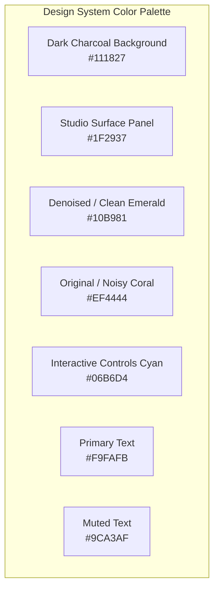

# UI/UX Design System & Layout Specification

> **Theme**: Cyber-Acoustic Studio Dark Theme  
> **Target Framework**: `customtkinter` (Dark Mode Native Integration)  
> **Resolution Target**: Minimum $1024 \times 680$, Default $1280 \times 800$

---

## 1. Design Philosophy & Aesthetic Guidelines

The UI is designed to feel like a **Modern Digital Audio Workstation (DAW) & Studio Mastering Utility**:
- **High-Contrast Dark Aesthetics**: Deep slate backgrounds with neon accent highlights (Emerald for clean audio, Coral Red for noisy original audio).
- **Zero Clutter**: Clean visual separation between File Import, Waveform Inspection, DSP Parameter Controls, and Export Actions.
- **Immediate Feedback**: Hover states on all buttons, live waveform progress scrubbing, and real-time A/B audio comparison.



---

## 2. Main Window ASCII Layout & Wireframe

```text
+-------------------------------------------------------------------------------------------------------+
|  [O] [=] [X]   NoiseRelief Studio — Audio & Video Noise Reduction GUI v1.0.0                          |
+-------------------------------------------------------------------------------------------------------+
|  +-------------------------------------------------------------+ +----------------------------------+ |
|  | [FILE DROP ZONE]                                            | | [DSP PARAMETER CONTROLS]         | |
|  |   +-------------------------------------------------------+ | |                                  | |
|  |   |            [+] Drag & Drop Audio / Video File         | | | Preset: [ Podcast Voice Clear v ]| |
|  |   |          Supports MP4, MKV, MOV, WAV, MP3, FLAC       | | |                                  | |
|  |   |          [ Browse File... ]   [ Browse Folder... ]    | | | Reduction Strength:              | |
|  |   +-------------------------------------------------------+ | | [======o=============] 80%       | |
|  |   Loaded: "podcast_interview_ep4.mp4" (04:15 | 48kHz Stereo) | |                                  | |
|  +-------------------------------------------------------------+ | Noise Mode:                      | |
|  | [WAVEFORM COMPARISON]                                       | | (*) Stationary  ( ) Dynamic      | |
|  |   +-------------------------------------------------------+ | |                                  | |
|  |   | [ORIGINAL - NOISY]  SNR: 14.2 dB                      | | | High-Pass Filter (Rumble Cut):   | |
|  |   | ~~~~~~~~~~~~~~~~~~~~~~~~~~~~~~~~~~~~~~~~~~~~~~~~~~~~~ | | | [===o==============] 80 Hz      | |
|  |   +-------------------------------------------------------+ | |                                  | |
|  |   | [DENOISED - CLEAN]  SNR: 29.8 dB (+15.6 dB)           | | | Time Smoothing:                  | |
|  |   | ===================================================== | | | [====o=============] 3 frames    | |
|  |   +-------------------------------------------------------+ | |                                  | |
|  |                                                             | | Output Normalization:            | |
|  |   00:00 [====|====================================] 04:15   | | [X] Peak Normalize (-1.0 dBFS)   | |
|  |                                                             | |                                  | |
|  |   [⏮]   [ ▶ PLAY ]   [⏹]   [ 🔁 A/B: CLEAN ]  Vol: [====o] | | [X] Soft Noise Gate (-45 dB)     | |
|  +-------------------------------------------------------------+ +----------------------------------+ |
|  +--------------------------------------------------------------------------------------------------+ |
|  | [EXPORT PANEL]                                                                                   | |
|  |   Output Directory: [ D:\AudioProjects\Cleaned\                     ] [ Browse... ]              | |
|  |   Output Video Action: (X) Lossless Stream-Copy Mux (Instant)  ( ) Audio-Only Extraction         | |
|  |   Progress: [========================================] 100% (Completed in 2.8s)                 | |
|  |                                                [ Open Output Folder ]  [ EXPORT CLEANED MEDIA ]  | |
|  +--------------------------------------------------------------------------------------------------+ |
+-------------------------------------------------------------------------------------------------------+
```

---

## 3. UI Component Specifications

### 3.1. Drag & Drop Zone (`src/gui/components/drop_zone.py`)
- **Idle State**: Border dotted `#374151`, background `#1F2937`, icon with "Drag & Drop Audio or Video here".
- **Drag Over State**: Border animated glow `#10B981`, background `#1E3A8A` (subtle dark indigo/emerald highlight).
- **Loaded State**: Compact file chip displaying filename, format badge, audio sample rate, channel count, and duration.

### 3.2. Waveform Visualizer Widget (`src/gui/components/waveform_widget.py`)
- **Dual Display Mode**:
  - Top Strip: Original noisy track (Coral red `#EF4444` waveform).
  - Bottom Strip: Denoised clean track (Neon emerald `#10B981` waveform).
- **Interactive Scrubber**: Clicking or dragging on the waveform jumps audio playback directly to that timestamp.
- **Playhead**: Vertical cyan line (`#06B6D4`) moving smoothly at 60 FPS during playback.

### 3.3. Player Bar Controls (`src/gui/components/player_controls.py`)
- **Play / Pause Button**: Toggle button with spacebar shortcut.
- **Instant A/B Toggle Button**:
  - State A (`#EF4444`): Playing original unprocessed audio.
  - State B (`#10B981`): Playing denoised audio.
  - Shortcut: Press `Tab` or `A` key for instantaneous live switching.
- **Volume Slider & Timestamp**: Current time / total duration format (`MM:SS`).

### 3.4. Settings & Presets Panel (`src/gui/components/settings_panel.py`)
- **Quick Preset Dropdown**:
  - `Default Studio Voice` (Strength: 80%, High-pass: 80Hz, Stationary)
  - `Mild Background Hiss` (Strength: 50%, High-pass: 40Hz, Stationary)
  - `Aggressive Fan / Air Conditioner` (Strength: 95%, High-pass: 100Hz, Stationary)
  - `Outdoor Wind & Traffic` (Strength: 85%, High-pass: 120Hz, Non-Stationary)
  - `Vintage Vinyl / Tape Clean` (Strength: 70%, Low-pass: 14kHz, Stationary)
