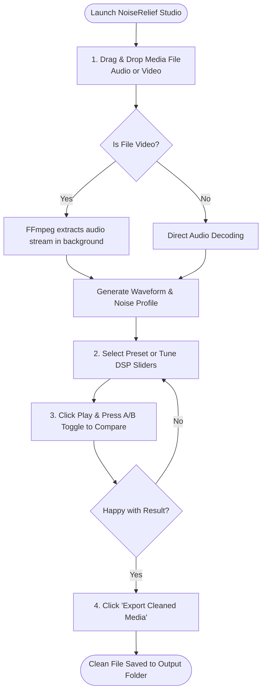

# User Manual & Operation Guide

> **Application**: NoiseRelief Studio — Audio & Video Noise Reduction GUI  
> **Target Audience**: End Users, Podcasters, Video Editors, Content Creators

---

## 1. System Requirements & Installation

### 1.1. Prerequisites
- **Operating System**: Windows 10/11 (64-bit), macOS 12+ (Intel/Apple Silicon), or Ubuntu 22.04+ Linux.
- **Python**: Python 3.10, 3.11, or 3.12 installed.
- **FFmpeg**: Required for video audio extraction and remuxing (the application auto-detects system FFmpeg or bundled local binary).

### 1.2. Quick Installation

```bash
# 1. Clone or download repository
git clone https://github.com/your-username/python-audio-noise-reduction.git
cd python-audio-noise-reduction

# 2. Create and activate virtual environment
python -m venv venv

# Windows (Command Prompt / PowerShell)
.\venv\Scripts\activate

# macOS / Linux
source venv/bin/activate

# 3. Install required packages
pip install -r requirements.txt

# 4. Launch Application
python src/main.py
```

*(On Windows, you can also double-click `run.bat` for instant launch).*

---

## 2. Step-by-Step User Workflows



### 2.1. Processing an Audio File
1. **Import**: Drag a `.wav`, `.mp3`, `.m4a`, or `.flac` file into the main drop area, or click **Browse File...**.
2. **Tune**: Select a preset from the dropdown (e.g., *Default Studio Voice*).
3. **Listen & Compare**: Press **Play** ($\text{Space}$) to listen. Click the **A/B Toggle** ($\text{Tab}$) to alternate between the noisy original and the cleaned audio in real time.
4. **Export**: Choose destination folder and click **Export Cleaned Media**.

### 2.2. Processing a Video File
1. **Import Video**: Drag an `.mp4`, `.mkv`, `.mov`, or `.avi` video into the window.
2. **Automatic Audio Extraction**: The software automatically extracts the audio track without touching the video.
3. **Adjust Settings**: Fine-tune the reduction slider to remove background air conditioner, fan, or street noise.
4. **Lossless Remux Export**: Click **Export Video**. In just 2–5 seconds, the app replaces the video's original audio track with the cleaned audio using **stream copy** — no long re-rendering and 100% original video resolution preserved.

---

## 3. Parameter Tuning Guide

| Problem in Audio | Recommended Action |
| :--- | :--- |
| **Air conditioner hum / low electrical drone** | Set **High-Pass Cutoff** to $80\text{ Hz}$ or $100\text{ Hz}$. Set **Reduction Strength** to $80\%$. |
| **Microphone hiss / tape white noise** | Use **Stationary Mode**. Increase **Reduction Strength** to $85\%$. Set **Time Smoothing** to $3$ or $4$. |
| **Robotic / watery voice artifacts ("Musical Noise")** | Reduce **Reduction Strength** from $90\%$ down to $70\% - 75\%$. Increase **Time Smoothing** to $5$. |
| **Wind or passing car noise** | Switch Noise Mode to **Dynamic / Non-Stationary**. Set **High-Pass** to $120\text{ Hz}$. |
| **Residual noise between spoken words** | Enable **Soft Noise Gate** at $-45\text{ dBFS}$. |

---

## 4. Keyboard Shortcuts

| Shortcut | Action |
| :--- | :--- |
| `Space` | Play / Pause Audio Preview |
| `Tab` or `A` | Instant A/B Toggle (Original vs. Cleaned) |
| `Ctrl + O` | Open File Dialog |
| `Ctrl + E` | Trigger Export |
| `←` / `→` | Seek 5 seconds backward / forward |

---

## 5. Troubleshooting & FAQ

#### Q: The app says "FFmpeg binary not found".
**A**: Ensure FFmpeg is installed and added to your system `PATH`, or place `ffmpeg.exe` directly inside the `bin/` directory within the project folder.

#### Q: Why is video export so fast? Did it re-encode the video?
**A**: The video is **not** re-encoded. The application uses FFmpeg stream-copy (`-c:v copy`), which replaces only the audio track while copying the video stream bit-for-bit in seconds.

---

## 6. Support & Contact Information

NoiseRelief Studio is designed and developed by **Coder & AccoTax**.

- 🌐 **Website**: [www.codernaccotax.co.in](https://www.codernaccotax.co.in)
- 📞 **Phone**: `7003756860`
- ✉️ **Inquiries**: Custom software, feature requests, and business inquiries.

